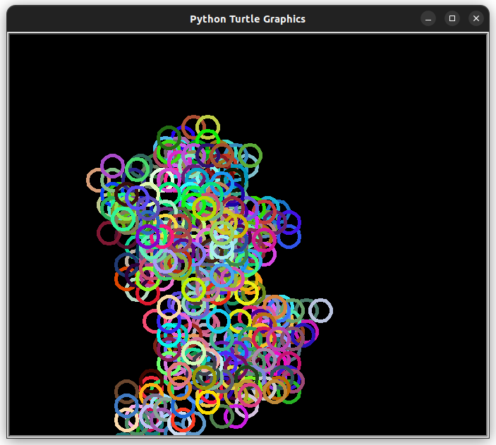
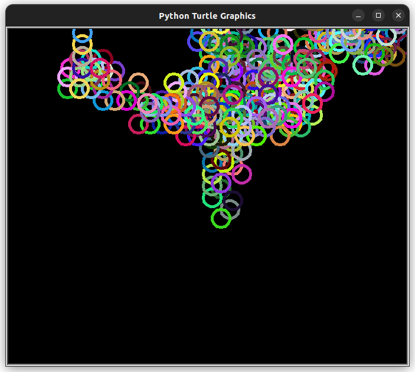
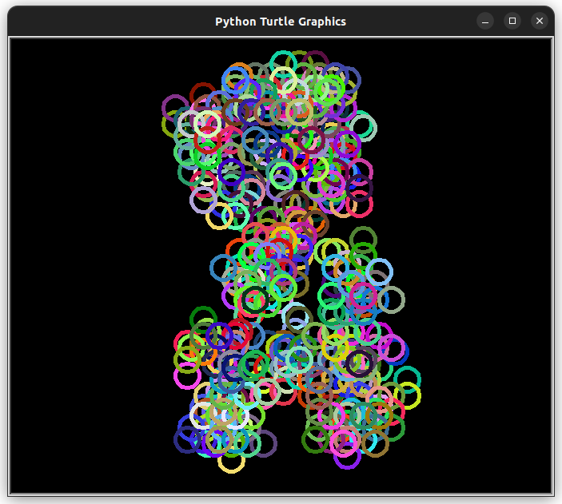

# Random Spirograph

Tejas [twitter](https://twitter.com/achte_te)

This program generates a Spirograph where each Circle is generated at different locations, determined by a Random Walk Algorithm. Each Circle is drawn using a Random Color on a Black Screen.


### Requirements:
[Turtle](https://docs.python.org/3/library/turtle.html)

To Run:
```sh
git clone git@github.com:achte-2022/Random-Spirograph.git
cd Random-Spirograph
python3 main.py
```


Example Outputs:

### Image 1:


### Image 2:


### Image 3:

